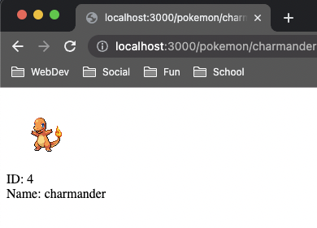
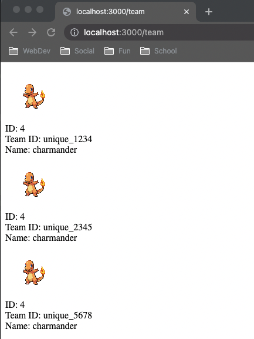
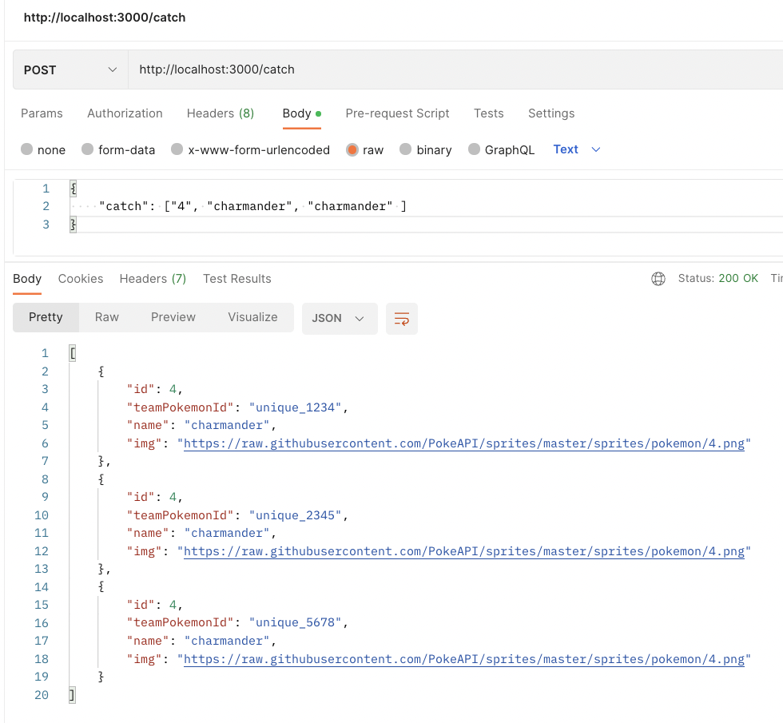
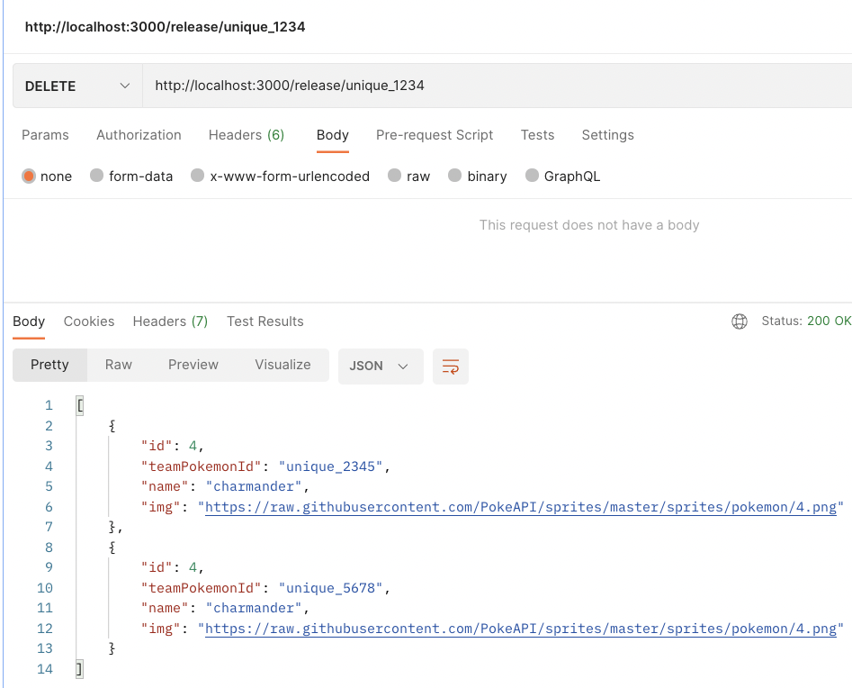

## Testing/Examples File

This file will describe how each of the 5 requirements will be tested, with provided example screenshots/JSON payload, and expected behaviors.

### GET /pokemon/:id


- Visiting `/pokemon/charmander` or `/pokemon/4` should render the page above.

### GET /team

- Assuming this is a team of 3 Charmanders, each with their own unique team IDs.
- Built from the below `TEAM` array, which was generated from the `POST` and `PUT` request below.
```text
TEAM = [
    { id: 4, teamPokemonId: 'unique_1234', name: 'charmander', img: charImg },
    { id: 4, teamPokemonId: 'unique_2345', name: 'charmander', img: charImg },
    { id: 4, teamPokemonId: 'unique_5678', name: 'charmander', img: charImg }
  ];
```
- Where `charImg` is a reference to the sprite img from the PokeAPI response.

### POST /catch

- Posting with the following JSON data:
```text
{
    "catch": ["4", "charmander", "charmander"]
}
```
- This will add 3 Charmanders to our team, each with their unique team id generated.
- Will APPEND to current team. If team is full do nothing.
- Response will be the state of our team after adding.

### PUT /catch
- Similar to POST, but will replace the entire team.

### DELETE /release/:pokemonTeamId

- We send a DELETE request to `/release/unique_1234`
- This will delete one of the charmanders with this ID on our team from the above screenshot.
- Response should be a JSON response of the state of our team AFTER the removal is done.
